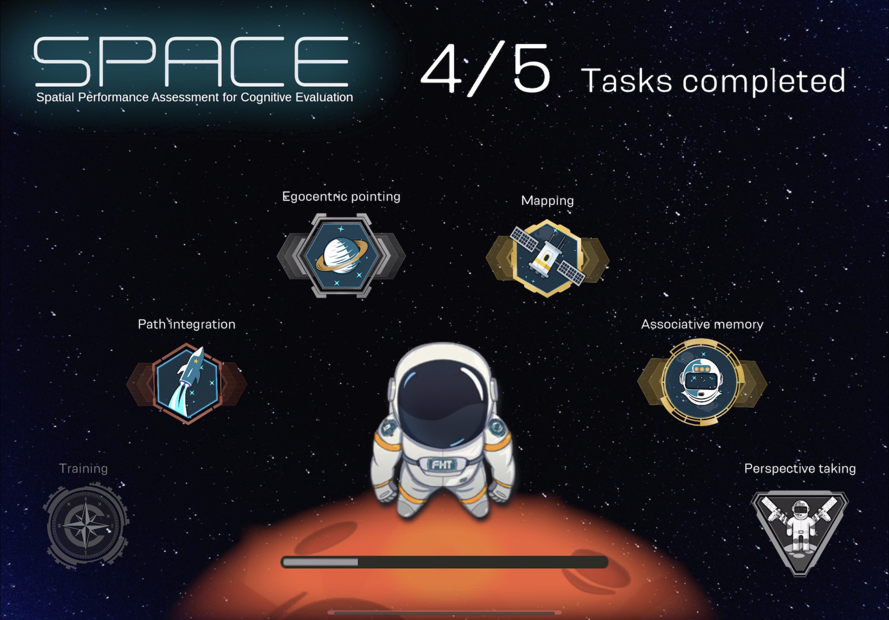
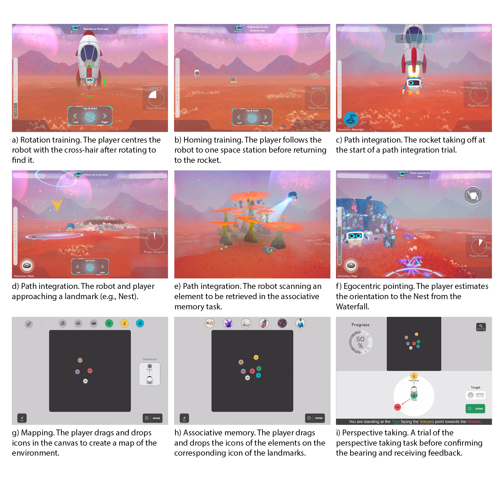
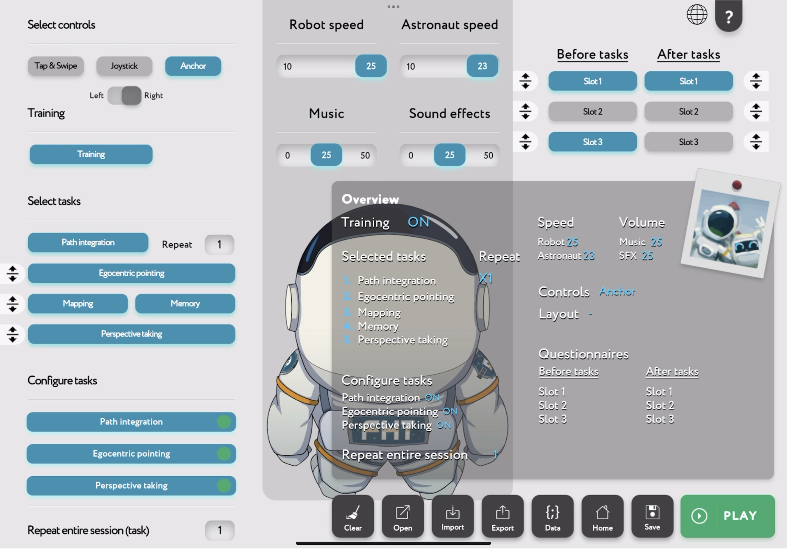

# SPACE Instructions
# Welcome to the <SPACE> cognitive evaluation game.

# Table of Content
- [1. Introduction of the game SPACE](#1-introduction-of-the-game-space)
- [2. Log in](#2-log-in)
- [3. Play! Settings! Movie!](#3-play-configuration-movie)
  - [Play](#play)
  - [Settings](#settings)
    - [Configuration Panel – Instructions](#configuration-panel--instructions)
    - [Steps to Configure the Path Integration](#steps-to-configure-the-path-integration)
    - [Error When Activating a Trial](#error-when-activating-a-trial)
    - [Solving Errors](#solving-errors)
    - [Order of Administration of Trials](#order-of-administration-of-trials)
    - [Landmarks Orientation](#landmarks-orientation)
    - [Quick Configuration](#quick-configuration)
    - [Randomized Placement](#randomized-placement)
  - [Movie](#movie)
- [4. Setup your own customized game with configuration](#4-setup-your-own-customized-game-with-configuration)
- [5. Output Data](#5-output-data)

## 1. Introduction of the game SPACE
 
 
Welcome to **SPACE**!

SPACE is an iPad-based serious game designed for a thorough evaluation of spatial abilities, which can be indicative of early cognitive impairment. In SPACE, players take on the role of an astronaut on a mission to determine if a new planet can support life.

The game begins with an extensive training phase that allows players of all ages to familiarize themselves with the control interface while assessing basic visuospatial skills. This phase effectively minimizes confounding variables by ensuring players understand the interface before moving on to the main tasks.

SPACE features five spatial tasks: path integration, egocentric pointing, mapping, associative memory, and perspective-taking. These tasks are designed to recruit critical brain regions (i.e., hippocampus and entorhinal cortex) involved in spatial navigation. Set on a foreign planet, the game captivates players while providing an environment devoid of landmarks, which is crucial for assessing spatial knowledge acquisition.

SPACE uses intuitive tasks supported by tutorial videos, real-time instructions, and a companion robot that guides players through each stage, offering feedback (e.g., facial expressions) and rewards (e.g., performance badges). Additionally, various control options (Tap & Swipe, Joystick, and Anchor) are available to accommodate different experience levels and help older adults interact more easily with the tablet.

### The tasks in SPACE

#### Training
**Rotation.** The player learns to rotate in the VE by swiping left and right on the screen to find the robot until it aligns with the centre of a cross-hair.

**Translation.** The player learns to move forward to reach the robot by tapping and holding a button on the screen.

**Circuit.** The player learns to integrate rotations and translations by following the robot in a circuit around the planet. This phase is uniquely available if the Tap & Swipe control is used.

**Homing.** The player follows the robot from the rocket to two space stations on the planet before being asked to return unaided to the rocket. Throughout this task, the rocket remains visible to the player. Homing introduces the player to the logic of the path integration task.

#### Spatial tasks
**Path integration.** The player follows the robot to two distinct landmarks on the planet before being asked to return unaided to the rocket. At each landmark, the robot scans an item that the player will be asked to recall in a subsequent task of the game. Different from Homing in training, the rocket takes off at the start of each trial and remains invisible until the player completes the return journey and signals for its landing. At the end of each trial, the player is transported to the correct location of the rocket.

**Egocentric pointing.** The player performs a memory test for the locations encountered during the path integration task. The player is positioned in front of a landmark or the rocket and asked to complete a series of pointing trials to different landmarks. For each set of trials, the player is teleported to a new landmark on the planet.

**Mapping.** The player is asked to create a map of the planet by dragging and dropping multiple icons representing the landmarks they encountered during the path integration task. After dragging all the icons, an animation showing the correct position of the landmarks is displayed.

**Associative memory.** The player is asked to drag and drop icons in order to pair the items scanned by the robot with the corresponding landmarks they encountered during the path integration task. After completing the task, an animation shows the correct pairings.

**Perspective taking.**
The player is asked to imagine standing at a landmark facing another landmark by looking at the map of the planet. The player is then required to indicate the correct bearing towards a third landmark.

Data on rotation, translation, angular error, distance error, and time will be used to inform on player performance on all the tasks in SPACE.  

#### SPACE ecosystem

SPACE include also an ecosystem which is designed to allow researchers and clinicians with limited coding ability to easily configure each task according to their needs. 
Through the Experimenter Menu, users can select the language, type of control interface, the speed of the robot and astronaut, set the volume of music and sound effects, and decide whether to include pre-and post-game questionnaires. 
Users can also decide which spatial tasks (including training) will be part of the assessment, along with the task order and number of session repetitions. 
Due to the game's inherent logic, the path integration task is always the first to be completed since the knowledge acquired during this task (e.g., the position of landmarks) is necessary to complete the subsequent tasks. 
Through various configuration menus, users can set the number and position of landmarks in the VE included in the configuration, along with the order and characteristics of each trial.
Inherent to the configuration menus, a logic system allows users to proceed only if all the generated trials can be executed in the VE. 
Other functions such as repetitions, automated trial generation, and randomisation of trials offer novel and quick ways to design and conduct experiments on the fly. 
Finally, users can verify, in real-time, measures of the angular and distance relationships between landmarks to define different levels of difficulty. 
SPACE was designed to facilitate deployment in clinical settings where time is of the essence, and the clinician's knowledge of the SPACE ecosystem is limited. 
Through shortcut buttons or by importing JSON files in the Experimenter menu, clinicians and researchers can quickly load, administer, and share predefined configurations for their assessments consistently across clinics and laboratories worldwide.

## 2. Log in [Nana]
To start your adventure, you need to log in to the game:

1. Open the SPACE game application.
2. Enter your username and password that we send to you.
3. Click the **Log In** button.
4. Once you log in, the app will auto login everytime you use SPACE again. 

If you don't have an account yet, click on **Sign Up** to create a new one.

## 3. Play! Settings! Movie
### Play
Once logged in, you can start playing:

1. Click on the **Play** button on the main menu.
2. Choose your spaceship and customize your avatar.
3. Start your mission and enjoy the adventure.

### Settings
#### Configuration Panel – Instructions [Somehow Done]

This is the panel in which you can set the configuration of the path integration task and decide which landmarks to involve in it. In the configuration panel there are different sections: the **Canvas**, the **Top Panel (TP)**, the **Right Panel (RP)**, the **Left Panel (LP)**, and the **Bottom Panel (BP)**. Each of these parts has its specific functionality.

#### Steps to Configure the Path Integration

1. Activate the Landmarks
- Tap on the icons of the landmarks in the TP you want to activate.
- The activated icons in the TP and the slots of the coordinates will highlight.

2. Position the Landmarks
- **Drag and drop** the activated icons to the desired position on the planet in the Canvas.
- **OR**
- Tap on the activated slots in the RP and type the coordinates.

3. Set the Path Integration
- Drag and drop the activated icons from the TP to the slots in the LP.
- The Power button will show that the trial is not activated if incomplete.

4. Add Trials or Complete Configuration
- Add another trial or press the **Done** button to apply the configuration.
- The lines involving the specific activated trials will turn green to indicate readiness.

#### Error When Activating a Trial

If the canvas lines pass through a landmark area:
- The system will warn you that the configuration is invalid.
- Involved lines turn red.
- The row in the LP is highlighted in red.
- The Power button changes to an Exclamation mark.
- The Done button turns red indicating an error.

#### Solving Errors

To resolve errors, you have three options:

1. **Deactivate the Trial**
   - Tap the Exclamation mark button in the LP to deactivate the trial.
   - The red lines in the canvas will revert to grey.
   
2. **Reposition the Landmark**
   - Drag and drop the icon(s) in the canvas to a new position.
   - Ensure the lines and Done button are not red.
   
3. **Change the Landmark**
   - Drag and drop a new landmark icon from the TP to the LP slot.
   - Ensure the lines and Done button are not red.

#### Order of Administration of Trials

- The order in the LP reflects the administration order.
- You can reorganize the list in the LP by dragging each row.
- Reorganizing may change the orientation of the landmarks and cause errors.

#### Landmarks Orientation

- Default orientation is towards the rocket.
- Orientation changes based on the trial position.
- The orientation remains until the defining trial is deactivated or reordered.

#### Quick Configuration

- **Generate All:** Compiles all possible trials among the activated landmarks.
  - Decide which landmarks to activate and place them on the canvas.
  - Options in the BP:
    - **Randomize:** Generates random trials.
    - **Order:** Organizes trials by the TP order.
    - **First Different:** No two consecutive trials have the same first leg.
- **Activate All:** Quickly activates all listed trials.
#### Randomized Placement

- Set constraints with sliders for distance from the rocket and between landmarks.
- Press **Randomize** to place landmarks according to the constraints.

#### Visualizing Trials in the Canvas

- **Show Activated:** Highlights all active trials in the LP.
- **Hide All:** Hides all lines (green, grey, red) for a clear view or screenshot.

#### Matrices

- **Angles:** Shows angular relation between landmarks.
- **Distances:** Distance between landmarks from spawn point to spawn point.
- **PI Angles:** Rotation needed from the second landmark to the rocket.
- **Path Distances:** Sum of the two legs of the trial, excluding homing.

#### Bottom-Right Panel Functionalities

- **Screenshot:** Takes a screenshot of the canvas.
- **Clear:** Resets the menu.
- **Back:** Returns to the Experimenter menu without saving.
- **Save:** Saves the configuration locally, even if incomplete.
- **Done:** Applies the configuration and returns to the Experimenter menu.
  
#### Final Note

Once satisfied with the settings, press **Done** to apply and save your configuration. If not saved, changes will be lost upon exiting the Experimenter Menu.

---

### Movie
Watch the introductory movie to get a feel of the game:

1. From the main menu, select **Movie**.
2. Sit back and enjoy the cinematic introduction to SPACE.
3. There are two instructional movies: One is the walk through of different tasks. And Another one is about the configuration panel. 

## 4. Setup your own customized game with configuration
You can tailor the game to your liking by setting up a customized game:

1. Go to the **Custom Game** option from the main menu.
2. Choose your preferred game mode (Survival, Exploration, etc.).
3. Configure the game parameters such as difficulty level, number of players, and starting resources.
4. Save your custom game settings.
5. Click **Start Custom Game** to begin playing with your chosen configuration.

## 5. Output Data 
After each game session, you can view and manage your output data:
1. Demographics: Age; Gender; Level of Education
2. positional data inside game.
3. (Ego)Angular deviation
4. Coordinate data
5. Accuracy (memory)
6. Angular data.
7. Time.
8. User id/Name/Session id.

Enjoy your journey through the stars with SPACE!
